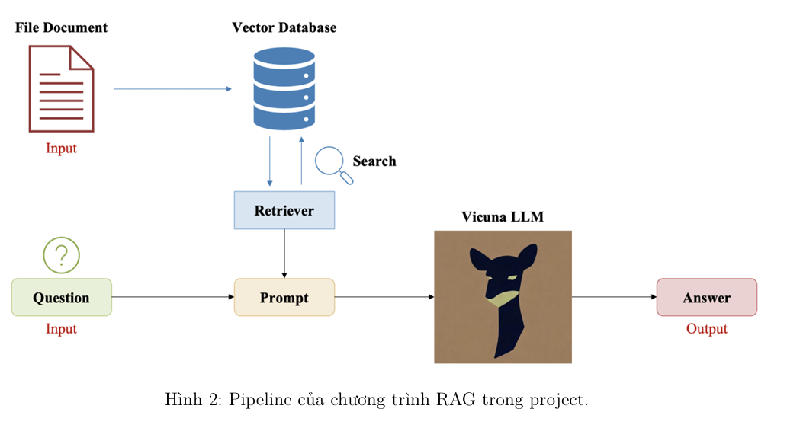

# RAG

# 📘 PDF RAG Assistant – AIO 2025 Project

Ứng dụng hỏi đáp tài liệu PDF bằng tiếng Việt, xây dựng dựa trên mô hình **RAG (Retrieval-Augmented Generation)**, kết hợp **LLM (Vicuna 7B)** và **semantic chunking**. Giao diện được xây dựng với **Streamlit**, người dùng có thể upload tài liệu, đặt câu hỏi và nhận câu trả lời tự động.

---

## 🧱 Cấu trúc thư mục và mô tả

```plaintext
aio-rag/
│
├── main.py                  # Điểm khởi chạy ứng dụng Streamlit
├── requirements.txt         # Danh sách thư viện cần cài
├── config.py                # (Tùy chọn) file cấu hình chung
├── api.py                   # (Tùy chọn) khởi tạo REST API nếu mở rộng
├── .env                     # (Tùy chọn) chứa biến môi trường như API key
│
├── app/
│   ├── core/                # Logic lõi: load model, xử lý PDF, build RAG chain
│   │   ├── embeddings.py    # Load embedding model
│   │   ├── llm.py           # Load LLM Vicuna
│   │   ├── pdf.py           # Xử lý PDF: chunking, vector DB, build chain
│   │   └── prompt.py        # (Tùy chọn) custom prompt template
│   │
│   ├── ui/                  # Giao diện người dùng Streamlit
│   │   ├── interface.py     # Giao diện chính: upload, hỏi, trả lời
│   │   └── __init__.py
│   │
│   ├── services/            # (Tùy chọn) xử lý trung gian
│   │   └── question_handler.py  # (Tạm thời trống) quản lý hỏi đáp, lịch sử, format
│   │
│   └── api/                 # (Tùy chọn) triển khai REST API (FastAPI)
│       ├── __init__.py
│       ├── routes.py        # Khai báo endpoint như /ask
│       └── schemas.py       # Định nghĩa model dữ liệu (Pydantic)
│
└── utils/                   # Tiện ích dùng chung
    ├── logger.py            # (Tùy chọn) logging ra console/file
    └── file.py              # (Tùy chọn) xử lý file upload, validate...
```

---

## 🔁 Pipeline cơ bản



---

## 🚀 How to run

```bash
# Tạo env và cài thư viện
bash setup.sh

# Hoặc thủ công:
conda create -n aio-rag python=3.11
conda activate aio-rag
pip install -r requirements.txt

# Chạy ứng dụng
streamlit run main.py
```
