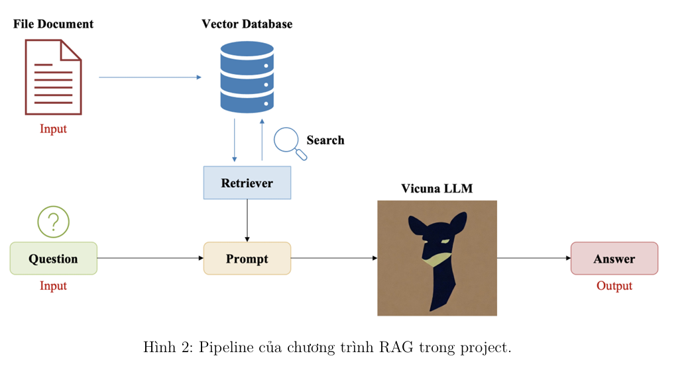

# RAG

# 📘 PDF RAG Assistant – Project

A Vietnamese-language PDF question-answering application, built using the **RAG (Retrieval-Augmented Generation)** architecture. It combines a **LLM (Vicuna 7B)** with **semantic chunking** techniques. The interface is built with **Streamlit**, allowing users to upload documents, ask questions, and receive automatic answers.

---

## 🧱 Directory Structure & Description

```plaintext
rag/
├── app/
│   ├── core/
│   │   ├── embeddings.py
│   │   ├── llm.py
│   │   ├── pdf.py
│   ├── image/
│   │   └── logo.png
│   ├── ui/
│   │   └── interface.py
├── main.py
├── requirements.txt
├── setup.sh
```

---

## 🔁 Basic Pipeline



---

## 🚀 How to Run

```bash
# Create environment and install dependencies
bash setup.sh

# Or manually:
conda create -n aio-rag python=3.11
conda activate aio-rag
pip install -r requirements.txt

# Launch the app
streamlit run main.py
